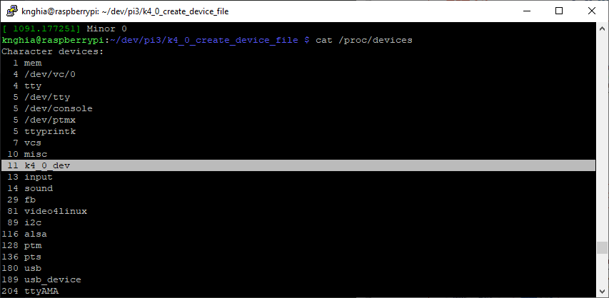
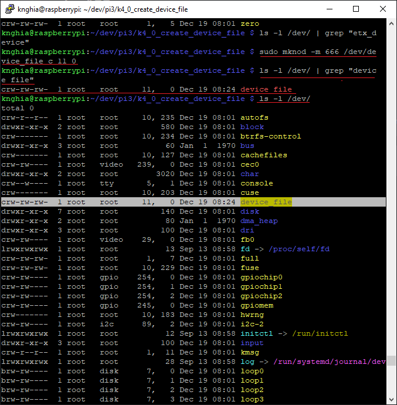

<span style="font-family: Courier New">

## 1. Run 
Move in **k4_0_device_file**
```shell
$ sudo make
```
Create the new major and minor. **dev_t dev = MKDEV(11, 0);**

With name **register_chrdev_region(dev, 1, "k4_0_dev");**
## 2. View
View the Character devices
```shell
$ sudo cat /proc/devices
```

You can see **11 k4_0_dev**

View device file
```shell
$ ls -l /dev/
```
It not here.
## 2. Add to the device file store
```shell
mknod -m <permissions> <name> <device type> <major> <minor>
<name> – your device file name that should have a full path (/dev/name)
<device type> – Put c or b
c – Character Device
b – Block Device
<major> – major number of your driver
<minor> – minor number of your driver
-m <permissions> – optional argument that sets the permission bits of the new device file to permissions
```
Example : 
```shell
$ sudo mknod -m 666 /dev/device_file c 11 0
```
View when is filted
```shell
$ ls -l /dev/ | grep "device_file"
```
View all devices
```shell
$ ls -l /dev/
```


You can see **11 device_file** in **the device file store**

### Reference 
[source](https://embetronicx.com/tutorials/linux/device-drivers/device-file-creation-for-character-drivers/)

</span>