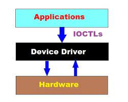

# 1. IOCTL in Linux (I/O Control)

Communicate between the Userspace and Kernel Space

IOCTL is referred to as Input and Output Control



Some Real-time Applications of IOCTL are:
+	Ejecting the media from a “cd” drive
+	Changing the Baud Rate of the Serial port
+	Adjusting the Volume
+	Reading or Writing device registers

Specific library

```c
#include <linux/ioctl.h>
```

You need some ioctl values register to device file. 

```c
#define WR_VALUE _IOW('a','a',int32_t*)
#define RD_VALUE _IOR('a','b',int32_t*)
```

Declare a ioctl function ( **.unlocked_ioctl = my_ioctl**) in the file_operations struct

```c
static struct file_operations fops ={
    .owner          = THIS_MODULE,
    .read           = my_read,
    .write          = my_write,
    .open           = my_open,
    .unlocked_ioctl = my_ioctl,
    .release        = my_release,
};
```

The ioctl is accessed by the user space

```c
#define WR_VALUE _IOW('a','a',int32_t*)
#define RD_VALUE _IOR('a','b',int32_t*)
fd = open("/dev/my_device", O_RDWR);
ioctl(fd, WR_VALUE, (int32_t*) &number); 
ioctl(fd, RD_VALUE, (int32_t*) &value);
```

# Note

```c
(int32_t*) &number		// is address of the "value" variable
(int32_t*) number		// is value of the "value" variable
```
