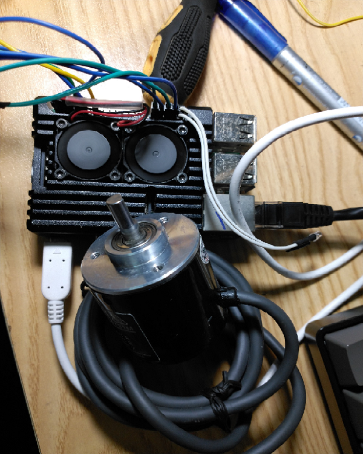
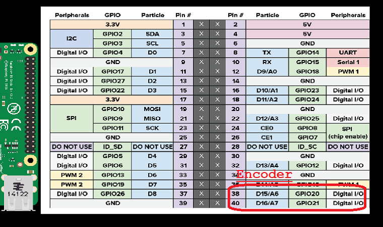
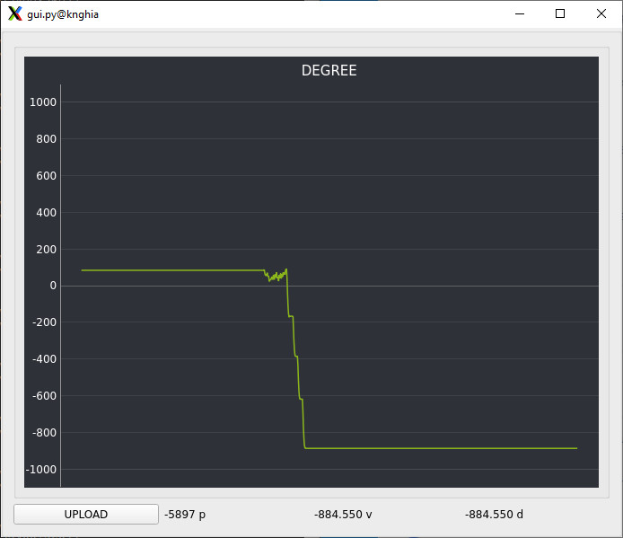

# 1. Read encoder using workqueu




# 2. Show gui

## 2.1 Read using python
```python
os.system("sudo chmod 777 /dev/etx_device")
file = os.open("/dev/etx_device", os.O_RDWR)
rx_date = os.read(file,256)
```

```cmd
make gui
```



## 2.2 Read using c
```cpp
...
int fd;
char read_buf[32];
...
fd = open("/dev/etx_device", O_RDWR);
read(fd, read_buf, 32);
```

```cmd
make read
```
