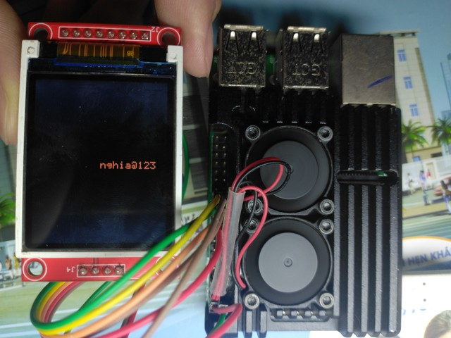

## 1 Seetup

### 1.1 /boot/config.txt

To enable spi with cs pin. Write 2 line into /boot/config.txt

```cmd
#dtparam=spi=on
dtoverlay=spi0-1cs,cs0_pin=8
```

### 1.2 Disable spidev

To register the your spi, you should disable spi using device tree overlay

**spidev_disabler.dts**

```cmd
/dts-v1/;
/plugin/;
/ {
    compatible = "brcm,bcm2708";
    fragment@0 {
        target = <&spidev0>;
        __overlay__ {
            status = "disabled";
        };
    };
};
```

**Makefile**

```Makefile
dt:
	dtc -@ -I dts -O dtb -o spidev_disabler.dtbo spidev_disabler.dts
	sudo dtoverlay spidev_disabler.dtbo
	sudo modprobe industrialio
	sudo dmesg | tail -n 10
```

### 1.3 Run

Start

```cmd
make start
```

End

```cmd
make end
```
### 1.4 Result

