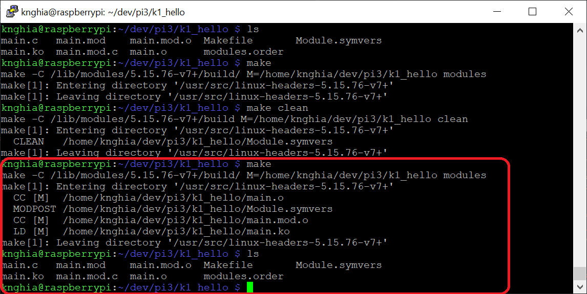
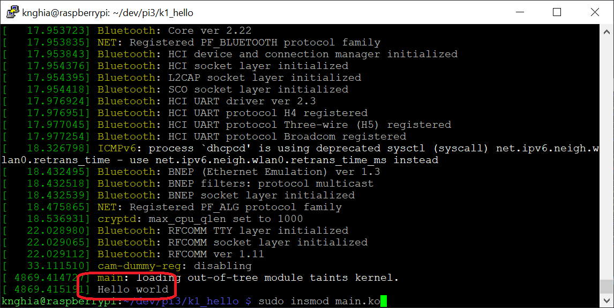
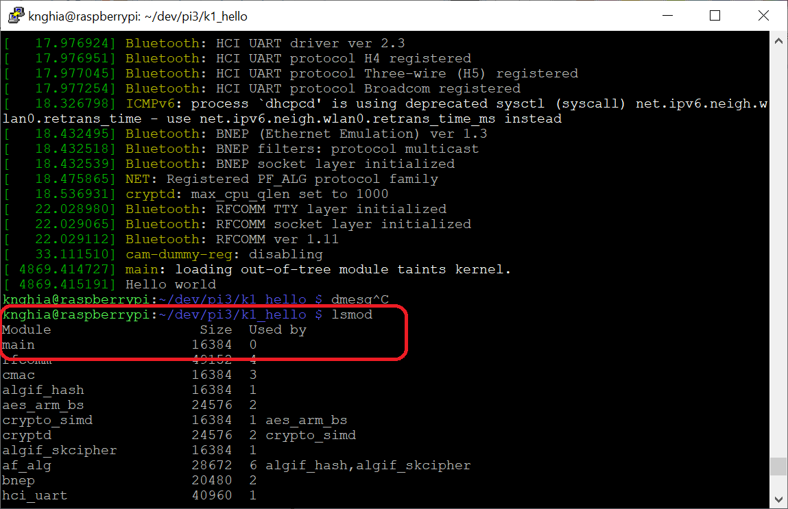
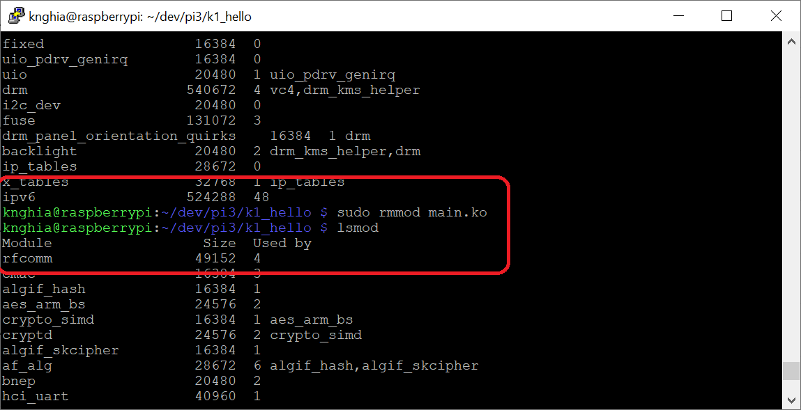

<span style="font-family: Courier New">

## 1. Begin by updating your package database
```shell
$ sudo apt-get update
```
## 2. Install the Raspbian header files for the kernel
```shell
$ sudo apt-get install raspberrypi-kernel-headers
```
## 3. Create file
```shell
$ mkdir pi3
$ cd pi3
$ mkdir k1_hello
$ cd k1_hello
$ touch main.c
$ touch makefile
```
## 4. Build the module
```shell
$ sudo make all
```


## 5. Load - Install the module
```shell
$ sudo insmod main.ko
```
```shell
$ dmesg
```

```shell
$ lsmod
```

```shell
$ sudo rmmod main.ko
$ lsmod
```

</span>