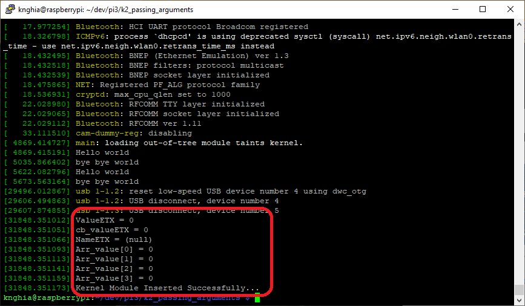
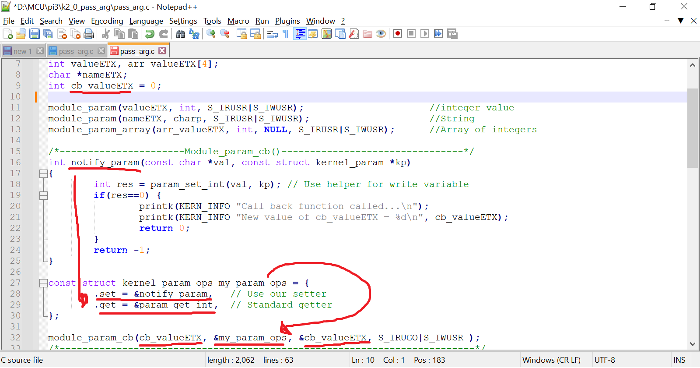
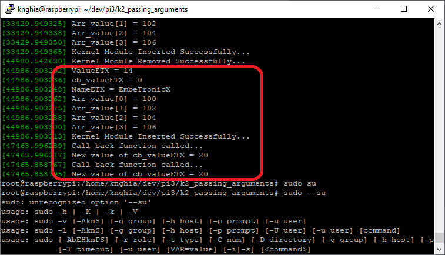

## 1. Build
```shell
$ sudo make
```

## 2. Loading the Driver
```shell
$ sudo insmod pass_arg.ko valueETX=14 nameETX="EmbeTronicX" arr_valueETX=100,102,104,106
```
## 2. The parameters
### 2.1 Path
```shell
$ /sys/module/pass_arg/parameters/cb_valueETX
``` 
### 2.2 New value



```shell
$ sudo su
$ echo 20 > /sys/module/pass_arg/parameters/cb_valueETX
```
