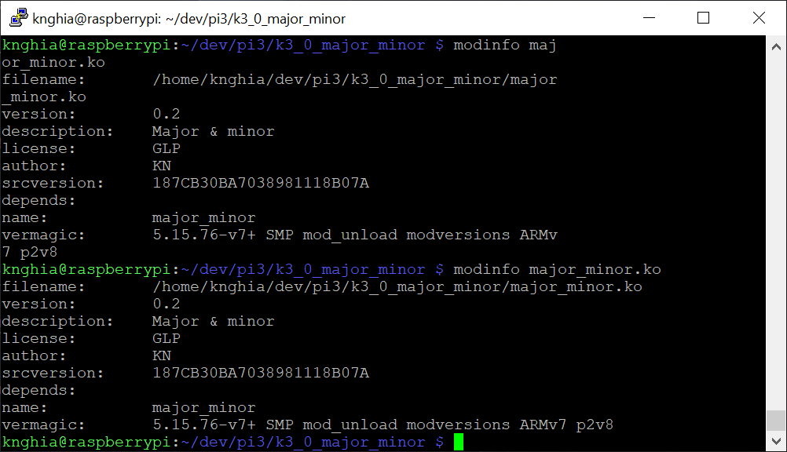
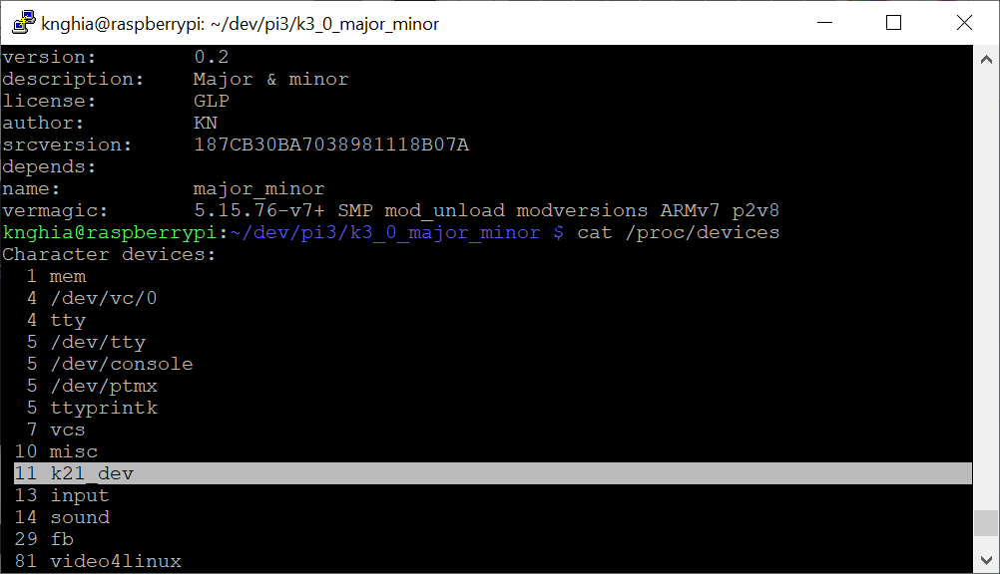

<span style="font-family: Courier New">

## 1. Major & minor
```shell
$ cat /proc/devices
```


## 2. Declaer the major & minor number
Include the library
```c
    #include <linux/fs.h>
```
Declare the number
```c
    dev_t dev = MKDEV(7, 0);
```

## 3. Info

## 4. Result
```c
register_chrdev_region(dev, 1, "k21_dev");
```

## 4. Delete
```c
register_chrdev_region(dev, 1, "k21_dev");
```

</span>