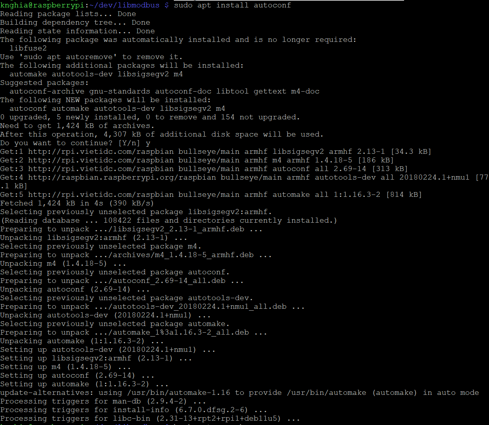
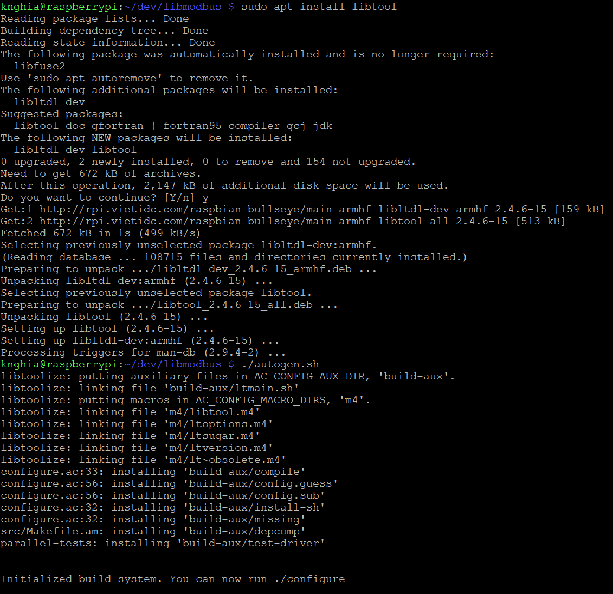
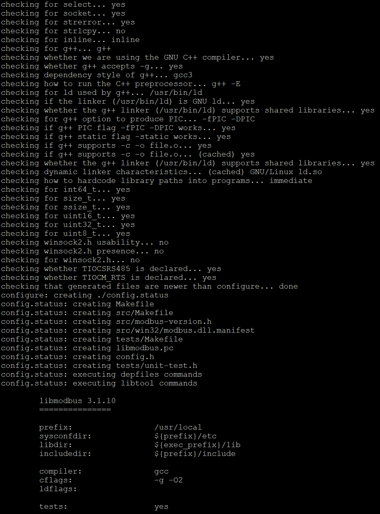
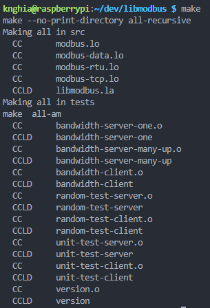
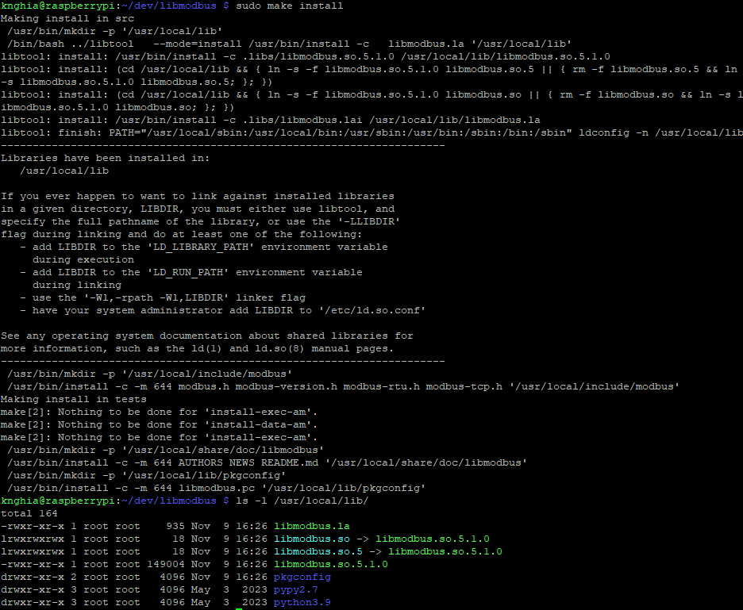

# 1. Install autoconf, libtool, autogen.sh

```cmd
git clone https://github.com/stephane/libmodbus.git
cd libmodbus
```
```cmd
sudo apt install autoconf
sudo apt install libtool
```
```cmd
./autogen.sh
./configure
make
sudo make install
```


```cmd
./autogen.sh
```

```cmd
./configure
```

```cmd
make
```

```cmd
sudo make install
```


```cmd
ls -l /usr/local/lib/
```

```cmd
sudo cp /usr/local/lib/libmodbus.so ./
sudo ldconfig
```
# 2. Run

```make
c:
	gcc main.c -o main -lmodbus
	./main "192.168.7.99" "502"
```
```c
int main(int argc, char *argv[]){

	printf("IP	: %s\n", argv[1]);
	printf("Port	: %s\n", argv[2]);

	modbus_t *ctx;
	i08 status = 0;

	ctx = modbus_new_tcp(argv[1], atoi((char*)argv[2]));
	modbus_set_debug(ctx, TRUE);
    // ...
```

You must set your id

```c
status = modbus_set_slave(ctx, 1); // ID = 1
```
# 3. Result


## 3.1 Code c

```cmd
knghia@raspberrypi:~/dev/pi3/tcp_ip/modbus_tcp $ make c
```
```cmd
gcc main.c -o main -lmodbus
main.c: In function ‘main’:
main.c:35:32: warning: implicit declaration of function ‘atoi’ [-Wimplicit-function-declaration]
   35 |  ctx = modbus_new_tcp(argv[1], atoi((char*)argv[2]));
      |                                ^~~~
./main "192.168.7.99" "502"
IP      : 192.168.7.99
Port    : 502
Connecting to 192.168.7.99:502
[00][01][00][00][00][06][01][01][00][00][00][10]
Waiting for a confirmation...
<00><01><00><00><00><05><01><01><02><00><00>
-----------------------
Coil [0] = 0 [1] = 0 [2] = 0 [3] = 0 [4] = 0 [5] = 0 [6] = 0 [7] = 0 [8] = 0 [9] = 0 [10] = 0 [11] = 0 [12] = 0 [13] = 0 [14] = 0 [15] = 0 
[00][02][00][00][00][06][01][04][00][00][00][08]
Waiting for a confirmation...
<00><02><00><00><00><13><01><04><10><00><01><00><02><00><03><00><04><00><05><00><06><00><07><00><08>
-----------------------
Input reg [0] =     0 [1] =     0 [2] =     0 [3] =     0 [4] =     1 [5] =     0 [6] =     2 [7] =     0 
[00][03][00][00][00][06][01][01][00][00][00][10]
Waiting for a confirmation...
<00><03><00><00><00><05><01><01><02><00><00>
-----------------------
Coil [0] = 0 [1] = 0 [2] = 0 [3] = 0 [4] = 0 [5] = 0 [6] = 0 [7] = 0 [8] = 0 [9] = 0 [10] = 0 [11] = 0 [12] = 0 [13] = 0 [14] = 0 [15] = 0 
[00][04][00][00][00][06][01][04][00][00][00][08]
Waiting for a confirmation...
<00><04><00><00><00><13><01><04><10><00><01><00><02><00><03><00><04><00><05><00><06><00><07><00><08>
-----------------------
Input reg [0] =     0 [1] =     0 [2] =     0 [3] =     0 [4] =     1 [5] =     0 [6] =     2 [7] =     0 
[00][05][00][00][00][06][01][01][00][00][00][10]
Waiting for a confirmation...
<00><05><00><00><00><05><01><01><02><00><00>
```

## 3.2 Code py

```cmd
knghia@raspberrypi:~/dev/pi3/tcp_ip/modbus_tcp $ make py 
```
```cmd
python3 main.py
-----------------------
coil         0-16:   [0, 0, 0, 0, 0, 0, 0, 0, 0, 0, 0, 0, 0, 0, 0, 0]
descrete     0-16:   [1, 1, 1, 1, 1, 1, 1, 1, 1, 1, 1, 1, 0, 0, 0, 0]
input reg    0-8:    [1, 2, 3, 4, 5, 6, 7, 8]
holding reg  0-8:    [1, 2, 3, 4, 5, 6, 7, 8]
-----------------------
coil         0-16:   [0, 0, 0, 0, 0, 0, 0, 0, 0, 0, 0, 0, 0, 0, 0, 0]
descrete     0-16:   [1, 1, 1, 1, 1, 1, 1, 1, 1, 1, 1, 1, 0, 0, 0, 0]
input reg    0-8:    [1, 2, 3, 4, 5, 6, 7, 8]
```